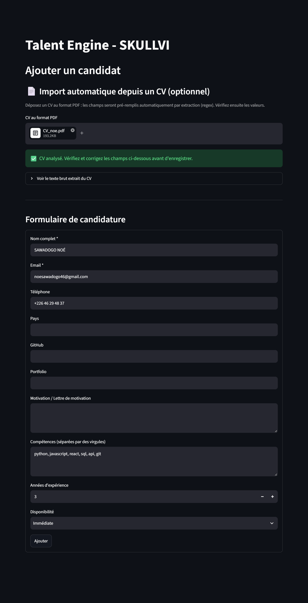
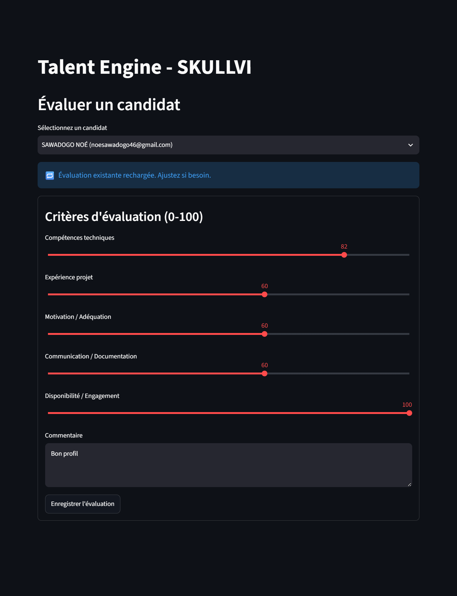
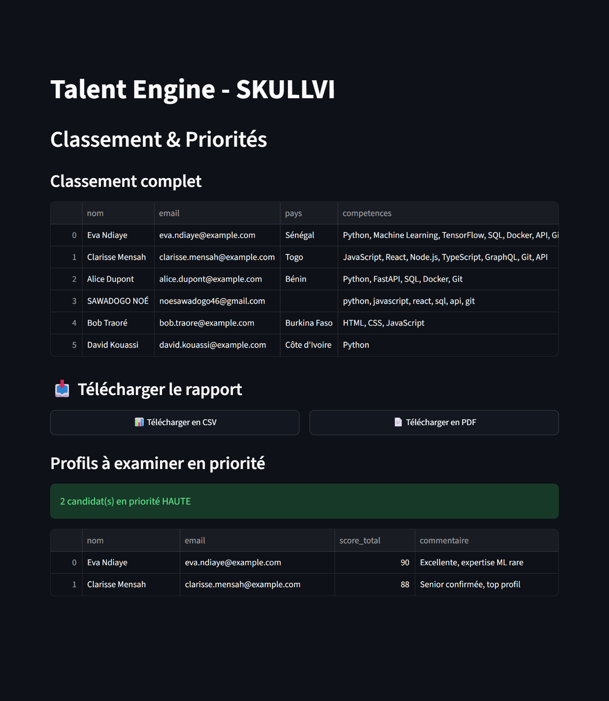
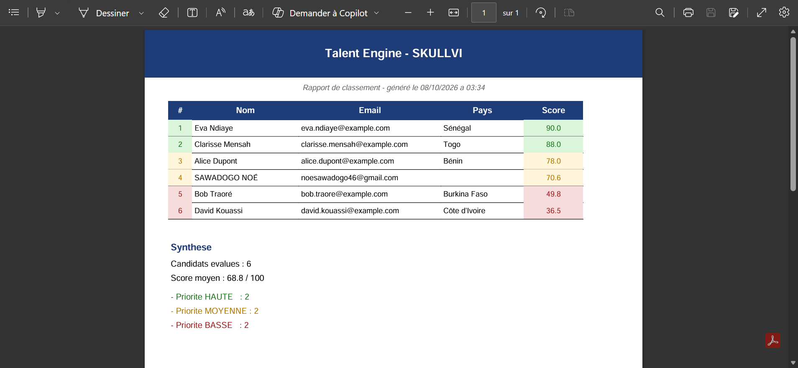

# 🧠 Talent Engine — SKULLVI

> Outil de qualification, de scoring et de priorisation des candidatures pour le programme développeurs **SKULLVI** de GevConsulting – Human Capital Program (HCP).

**Principe directeur : le système propose, l'humain décide.**

---

## 📌 Sommaire

1. [Contexte](#-contexte)
2. [Problème traité](#-problème-traité)
3. [Solution](#-solution)
4. [Fonctionnalités](#-fonctionnalités)
5. [Aperçu](#-aperçu)
6. [Architecture](#-architecture)
7. [Choix techniques](#-choix-techniques)
8. [Installation et lancement](#-installation-et-lancement)
9. [Données de démonstration](#-données-de-démonstration)
10. [Tests](#-tests)
11. [Limites connues](#-limites-connues)
12. [Pistes d'évolution](#-pistes-dévolution)
13. [Usage de l'IA](#-usage-de-lia)
14. [Auteur](#-auteur)

---

## 🎯 Contexte

SKULLVI reçoit régulièrement des candidatures pour ses programmes. Avec un volume croissant, il devient nécessaire de **structurer** la réception, la qualification et la priorisation des profils, sans déshumaniser le processus.

Ce projet répond à l'étape pratique du processus de sélection **SKULLVI × GevConsulting**, qui évalue la capacité à :

- comprendre et structurer un problème ;
- organiser des données ;
- concevoir une logique de qualification et de scoring ;
- proposer une solution simple, fonctionnelle et documentée ;
- anticiper les erreurs et prévoir des tests ;
- expliquer ses choix techniques.

---

## 🧩 Problème traité

> Comment **recevoir, qualifier, scorer et prioriser** des candidatures tout en gardant l'humain dans la boucle de décision ?

Le but n'est pas de remplacer le recruteur, mais de **lui faire gagner du temps** : pré-remplir, pré-qualifier, suggérer, classer. La décision finale reste humaine.

---

## 💡 Solution

Un **Talent Engine** en Python, avec une interface Streamlit, qui suit cinq étapes :

```text
┌──────────────────────┐
│ 1. Réception         │  Formulaire manuel ou import de CV PDF
│    de la candidature │  (extraction automatique par regex)
└──────────┬───────────┘
           ▼
┌──────────────────────┐
│ 2. Collecte          │  Nom, email, téléphone, pays, GitHub,
│    des informations  │  portfolio, compétences, expérience, dispo
└──────────┬───────────┘
           ▼
┌──────────────────────┐
│ 3. Qualification     │  Pré-évaluation à partir du profil
│    automatique       │  (compétences, expérience, disponibilité)
└──────────┬───────────┘
           ▼
┌──────────────────────┐
│ 4. Scoring pondéré   │  5 critères, score sur 100
│                      │  Poids configurables (config.json)
└──────────┬───────────┘
           ▼
┌──────────────────────┐
│ 5. Priorisation      │  Haute / Moyenne / Basse
│    et classement     │  Classement trié + profils prioritaires
└──────────────────────┘
```

---

## ⚙️ Fonctionnalités

### 📥 Import de CV
- Upload d'un CV au format PDF
- Extraction automatique : nom, email, téléphone, GitHub, portfolio, compétences, expérience
- Pré-remplissage du formulaire ; l'utilisateur vérifie et corrige avant d'enregistrer

### ✍️ Formulaire de candidature
- Champs essentiels et motivation
- Validation des champs obligatoires (nom, email)
- Détection des doublons par email

### 🤖 Auto-qualification
- Pré-remplit les scores d'évaluation à partir du profil du candidat
- Repose sur les compétences clés détectées, les années d'expérience et la disponibilité
- L'évaluateur peut tout ajuster librement

### 📊 Scoring pondéré
- 5 critères : technique, projet, motivation, communication, disponibilité
- Poids et seuils configurables dans `config.json`
- Score sur 100 calculé automatiquement

### 🏆 Classement et priorisation
- Classement par score décroissant
- Priorité **Haute / Moyenne / Basse** selon des seuils configurables
- Vue dédiée aux profils à examiner en premier

### 📄 Rapport PDF
- Export du rapport 

### 🗑️ Gestion des candidats
- Suppression individuelle (avec confirmation)
- Réinitialisation des évaluations
- Réinitialisation complète de la base

---

## 📸 Aperçu

### 📄 Import automatique d'un CV PDF

Pré-remplissage du formulaire par extraction regex.



### 💡 Évaluation avec auto-qualification

Les scores sont pré-remplis à partir du profil du candidat.



### 🏆 Classement et priorisation

Classement trié par score, avec identification des profils prioritaires.



### 📊 Rapport PDF

Export du rapport.



---

## 🏗️ Architecture

```text
talent_engine/
├── app.py                # Interface Streamlit et routage
├── scoring.py            # Score pondéré et détermination de la priorité
├── auto_eval.py          # Auto-qualification du profil candidat
├── cv_parser.py          # Extraction PDF → champs candidat (regex)
├── config.json           # Poids, seuils, mots-clés (externalisés)
├── seed_data.py          # Candidats de démonstration
├── seed_evaluations.py   # Évaluations de démonstration
├── test_scoring.py       # Tests du scoring
├── test_cv_parser.py     # Tests de l'extraction CV (18 tests)
├── captures/             # Captures d'écran pour le README
├── requirements.txt      # Dépendances Python
├── .gitignore            # Fichiers exclus du dépôt
└── README.md             # Ce fichier
```

### Stack

| Composant      | Technologie    | Pourquoi                                             |
|----------------|----------------|------------------------------------------------------|
| Interface      | **Streamlit**  | Prototypage rapide, UI propre, aucun front à écrire  |
| Base de données| **SQLite**     | Zéro configuration, fichier unique, portable         |
| Extraction PDF | **pdfplumber** | Fiable sur les PDF texte, gratuit, sans OCR          |
| Tests          | **pytest**     | Standard de fait, sortie lisible                     |

---

## 🧠 Choix techniques

### 1. Un scoring à règles plutôt qu'un LLM

C'est la décision la plus structurante du projet. J'ai volontairement écarté un LLM pour le cœur du scoring :

| Critère           | Système à règles                             | LLM                              |
|-------------------|----------------------------------------------|----------------------------------|
| **Déterminisme**  | ✅ Résultat reproductible à 100 %            | ❌ Non déterministe              |
| **Coût**          | ✅ Gratuit                                   | ❌ API payante                   |
| **Testabilité**   | ✅ Tests unitaires simples                   | ❌ Difficile à tester            |
| **Explicabilité** | ✅ Ex. : « 30 % technique, seuil à 80 »      | ❌ Boîte noire                   |
| **Vie privée**    | ✅ Traitement 100 % local                    | ❌ Données envoyées à un tiers   |

### 2. Un scoring externalisé dans `config.json`

Un recruteur peut modifier les pondérations **sans toucher au code**. Si SKULLVI décide de valoriser davantage la motivation que la technique, il suffit d'éditer un fichier JSON, sans redéploiement.

### 3. Une auto-qualification

Un recruteur qui reçoit 200 candidatures ne peut pas évaluer chaque profil à la main pendant 30 minutes. L'auto-qualification **pré-remplit** les scores à partir du profil ; l'humain ajuste ensuite en quelques secondes.

### 4. Une extraction de CV par regex

Pour les mêmes raisons que le scoring : déterministe, testable, gratuite et locale. Le parser est couvert par **18 tests unitaires**, qui traitent aussi bien les cas nominaux (CV propre) que les cas limites (texte vide, expérience non mentionnée, lignes parasites).

---

## 🚀 Installation et lancement

### Prérequis
- Python **3.11+** (testé sur 3.13)
- `pip`

### Étapes

```bash
# 1. Cloner le dépôt
git clone https://github.com/Sawadogo-cmk/talent_engine.git
cd talent_engine

# 2. Créer un environnement virtuel (recommandé)
python -m venv .venv
# Windows :
.venv\Scripts\activate
# macOS / Linux :
source .venv/bin/activate

# 3. Installer les dépendances
pip install -r requirements.txt

# 4. (Optionnel) Charger les données de démonstration
python seed_data.py
python seed_evaluations.py

# 5. Lancer l'application
streamlit run app.py
```

L'application s'ouvre à l'adresse <http://localhost:8501>.

---

## 🎲 Données de démonstration

`seed_data.py` remplit la base avec 5 candidats aux profils variés :

| Nom             | Profil                   | Expérience | Disponibilité |
|-----------------|--------------------------|------------|---------------|
| Alice Dupont    | Backend Python / FastAPI | 3 ans      | Immédiate     |
| Bob Traoré      | Junior HTML / CSS / JS   | 0 an       | 3 mois        |
| Clarisse Mensah | Senior React / Node      | 5 ans      | 1 mois        |
| David Kouassi   | Débutant Python          | 0 an       | 6 mois        |
| Eva Ndiaye      | ML / TensorFlow          | 4 ans      | Immédiate     |

`seed_evaluations.py` ajoute des évaluations pré-remplies pour tester le classement immédiatement. Le système peut ainsi être démontré sans rien saisir à la main.

---

## 🧪 Tests

Les parties critiques (scoring et extraction de CV) sont couvertes par des tests unitaires.

```bash
pytest -v
```

Extrait du résultat attendu pour le parser :

```text
test_cv_parser.py::test_email PASSED
test_cv_parser.py::test_telephone PASSED
test_cv_parser.py::test_github PASSED
test_cv_parser.py::test_linkedin PASSED
test_cv_parser.py::test_portfolio PASSED
test_cv_parser.py::test_nom PASSED
test_cv_parser.py::test_competences PASSED
test_cv_parser.py::test_experience_explicite PASSED
test_cv_parser.py::test_experience_par_annees_projets PASSED
test_cv_parser.py::test_experience_aucune_info PASSED
test_cv_parser.py::test_experience_mention_prioritaire PASSED
test_cv_parser.py::test_experience_une_seule_annee PASSED
test_cv_parser.py::test_experience_anglais PASSED
test_cv_parser.py::test_texte_vide PASSED
test_cv_parser.py::test_competences_liste_vide PASSED
test_cv_parser.py::test_competences_aucune_correspondance PASSED
test_cv_parser.py::test_nom_ignore_lignes_avec_chiffres PASSED
test_cv_parser.py::test_nom_ignore_lignes_avec_email PASSED
```

### Ce qui est couvert

- **Extraction générale** : email, téléphone, GitHub, LinkedIn, portfolio, nom, compétences
- **Expérience** : mention explicite, déduction par années de projets, absence d'information, priorité à la mention explicite, version anglaise
- **Cas limites** : texte vide, listes vides, aucune correspondance, lignes parasites

---

## ⚠️ Limites connues

Un système qui prétend n'en avoir aucune est un système que personne n'a testé sérieusement. Voici ce que le projet ne fait pas encore :

| Limite                      | Impact                              | Piste de résolution                  |
|-----------------------------|-------------------------------------|--------------------------------------|
| PDF scannés (images)        | Aucun texte extrait                 | Ajouter de l'OCR (Tesseract)         |
| Mise en page complexe       | Extraction parfois mélangée         | Compléter par un LLM sémantique      |
| Nom extrait par heuristique | Faux positifs possibles             | Détection par position et contexte   |
| Pas d'authentification      | Un seul utilisateur                 | Ajouter login et rôles               |
| SQLite mono-fichier         | Inadapté à 10 000+ candidats        | Migrer vers PostgreSQL               |
| Pas de notifications        | Le recruteur doit consulter l'app   | Ajouter emails et alertes            |

---

## 🛣️ Pistes d'évolution

- 🔐 Authentification multi-utilisateurs avec rôles (admin, évaluateur, lecteur)
- 📊 Tableau de bord statistique (taux d'évaluation, répartition des priorités, score moyen)
- 📤 Export CSV / Excel du classement filtré
- 🤖 Extraction par LLM (Mistral, GPT-4o-mini) en complément des regex, pour les PDF complexes
- 🔔 Notifications email aux candidats prioritaires
- ☁️ Déploiement (Streamlit Cloud, Railway, Render)
- 🧮 Scoring adaptatif : ajustement des poids selon les retours des recruteurs
- 🌍 Interface multilingue (FR / EN)

---

## 🤖 Usage de l'IA

Conformément au brief, voici comment l'IA a été utilisée.

| Usage               | Détail                                                                                                         |
|---------------------|----------------------------------------------------------------------------------------------------------------|
| Structuration       | Aide à la définition de l'architecture (séparation scoring / parser / UI)                                      |
| Débogage            | Résolution d'erreurs (`pkg_resources`, `numpy.int64` → SQLite, `session_state` Streamlit)                      |
| Rédaction du README | Aide à la mise en forme et à la structuration                                                                  |
| Génération de code  | Certaines fonctions utilitaires (extracteurs regex) ont été générées, puis relues, testées et ajustées         |

### Ma contribution personnelle

- **Logique métier** : pondérations, seuils, stratégie d'auto-qualification
- **Choix techniques** : système à règles plutôt que LLM, externalisation dans `config.json`
- **Tests** : écriture des tests unitaires, cas nominaux et limites
- **Validation** : tests manuels de bout en bout
- **Architecture** : décomposition modulaire (scoring, auto_eval, cv_parser)

> L'IA a été un accélérateur, pas un décideur. Chaque ligne a été relue, testée et validée.

---

## 👤 Auteur

**SAWADOGO Noé**
Licence en Intelligence Artificielle — African Development University (ADU), Niamey

- 💻 GitHub : [@Sawadogo-cmk](https://github.com/Sawadogo-cmk)
- 🌐 Portfolio : [portfolio-sawadogo-noe.netlify.app](https://portfolio-sawadogo-noe.netlify.app)
- 📧 Email : noesawadogo46@gmail.com

---

*Projet réalisé dans le cadre du processus de sélection SKULLVI × GevConsulting – Human Capital Program (octobre 2026).*
